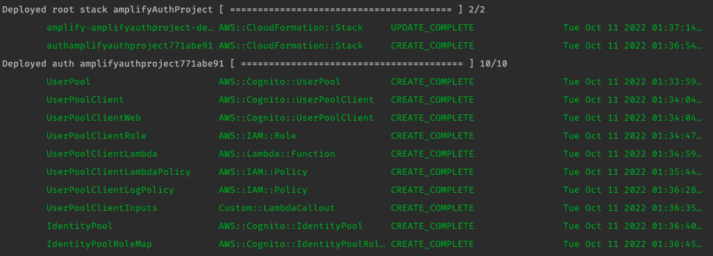

# 1장. 서버리스 컴퓨팅 시대의 풀스택 개발

서버리스 철학과 서버리스 애플리케이션의 특징 및 이점을 설명하고 AWS와 AWS Amplify CLI를 소개합니다.

### 서비스형 함수 (function as a service, FaaS)

클라우드 컴퓨팅을 백엔드 개발, 데브옵스 영역에 연관지어왔지만, FaaS의 등장은 클라우드 컴퓨팅을 처음 접하는
프론트엔드 개발자의 진입 장벽을 낮추기 충분했다.
최신 도구와 프레임워크, 에코시스템에 대한 지식을 활용하여 과거에 팀으로서 구축하고 유지했던 모든 기능을 가진
애플리케이션을 구축할 수 있다.

이 책은 AWS의 Amplify 프레임워크를 사용하는 새로운
세대의 도구와 서비스를 활용하여 프론트엔드, 백엔드 개발의 격차를 해소하는 데 초점을 맞춘다.

최종적으로, AWS 서비스를 활용한 백엔드와 리엑트를 활용한 프론트엔드로 클라우드에서 실제로 동작하는 풀스택
애플리케이션을 구축하는 것을 목표로 한다.

### Amplify 프레임워크

[Amplify](https://aws.amazon.com/ko/amplify/) 프레임워크는 CLI, 클라이언트 라이브러리, 툴체인,
웹 호스칭 플랫폼의 조합이다. 서버리스 함수와 인증, 그래프QL, API, 머신러닝, 스토리지, 분석 푸시 알림 등의 기능을
제공한다.

Amplify 구성 요소와 그 역할은 다음과 같다.

- CLI를 이용하여 명령줄에서 클라우드 서비스를 만들고, 구성하고, 배포할 수 있다.
- 클라이언트 애플리케이션에서 클라우드 서비스에 연결하고 상호작용할 수 있다.
- 툴체인은 코드 생성과 서버리스 함수 보일러플레이트같은 것을 통해 신속한 개발이 가능하다.
- 로스팅 플랫폼을 통해 원자 배포, 지속적 통합, 지속적 배포, 사용자 지정 도메인 등이 포함된 라이브 도메인에 배포 가능하다.

### Amplify CLI 설치와 설정

#### 글로벌 의존성 추가

```shell
~$ yarn global add @aws-amplify/cli
```

#### 사용자 자격 증명 부여

AWS 계정의 IAM 사용자를 이용하여 설정해야 한다. (CLI 상에서 IAM 권한을 부여하고 접근할 수 있도록 허용하기 위해)

```shell
~$ amplify configure
```

1. 위 명령어를 통해 aws.amazon 페이지에서 로그인

2. 로그인 이후 다시 돌아와 터미널에서 Enter 클릭!

3. 서비스 지역 선택

```shell
> Specify the AWS Region

? ap-northeast-2
```

4. 생성할 사용자 이름 입력

```shell
> Specify the username of the new IAM user:

? user name: amplify-cli-ap-northeast-2-undefined-study
```

5. 사용자 추가, [권한], [태그], [검토] 모두 next!

6. access-key-id, secret-access-key 입력

7. 리엑트 프로젝트 생성

```shell
~$ yarn create react-app 01_auth
```

8. 프로젝트 의존성 설치

```shell
~$ yarn add aws-amplify @aws-amplify/ui-react
```

9. Amplify 프로젝트 초기화

```shell
~$ amplify init
```

#### 생성된 aws-exports, amplify 폴더

`aws-exports`, 사용자의 자격 증명을 가지고 CLI에서 생성한 리소스 카테고리의 키-값의 쌍들

`amplify`, Amplify 프로젝트의 모든 코드와 설정이 포함되어 있다.

`amplify/backend`, AppSync 용 그래프QL, 스키마, 서버리스 함수를 위한 소스 코드,
현재 프로젝트의 상태를 나타내는 인프라 정의 코드 포함되어 있다.

`#current-cloud-backend`, Amplify push를 통해 클라우드에 배포된 리소스를 반영하기
위한 코드와 설정이 포함되어 있다.


#### 인증 서비스 배포

```
~$ amplify add auth
~$ amplify push
```




